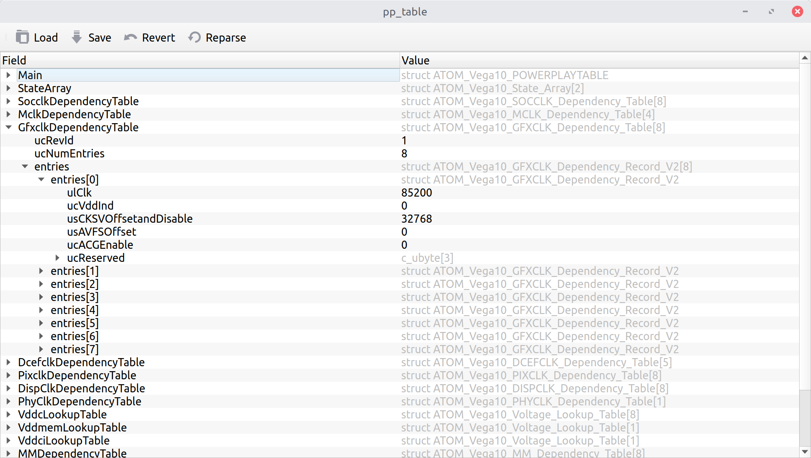

|flake8 lint badge|

AMDGPU PowerPlay table editor
=============================

A simple GUI tool to inspect and modify AMD GPU powerplay tables. Tries to
parse tables the same way as Linux driver does.

Installation
------------

Dependencies:

- Python 3.6 or later
- PyQt 5

On recent Debians/Ubuntus::

$ sudo apt-get install python3-pyqt5 python3-pip git
$ pip3 install --user git+https://github.com/amezin/amdgpu-pptable-editor-qt.git

At least on current Debian Testing, installation fails with::

  ERROR: Command errored out with exit status 1: /usr/bin/python3 /usr/share/python-wheels/pep517-0.7.0-py2.py3-none-any.whl/pep517/_in_process.py get_requires_for_build_wheel /tmp/tmpebufmefo Check the logs for full command output.

In this case, add `--no-use-pep517` flag::

$ sudo apt-get install python3-pyqt5 python3-pip git
$ pip3 install --user --no-use-pep517 git+https://github.com/amezin/amdgpu-pptable-editor-qt.git

Usage
-----

GUI app::

$ amdgpu-pptable-editor-qt

View current pptable::

$ amdgpu-pptable-editor-qt /sys/class/drm/card*/device/pp_table

``pp_table`` is only writable by root, so you'll have to save the file to a
temporary location and then ``cp`` it back to
``/sys/class/drm/card*/device/pp_table``. Or use ``sudoedit``::

$ env EDITOR=amdgpu-pptable-editor-qt sudoedit /sys/class/drm/card*/device/pp_table

.. Caution::
   You can completely screw up your card by modifying its pp_table.

.. |flake8 lint badge| image:: https://github.com/amezin/amdgpu-pptable-editor-qt/workflows/flake8%20lint/badge.svg
   :target: https://github.com/amezin/amdgpu-pptable-editor-qt/actions?query=workflow%3A%22flake8+lint%22
